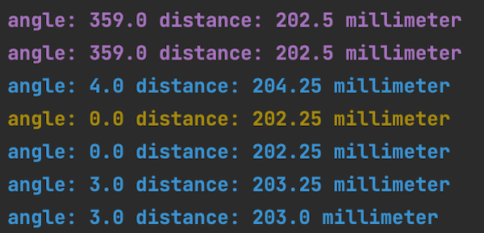
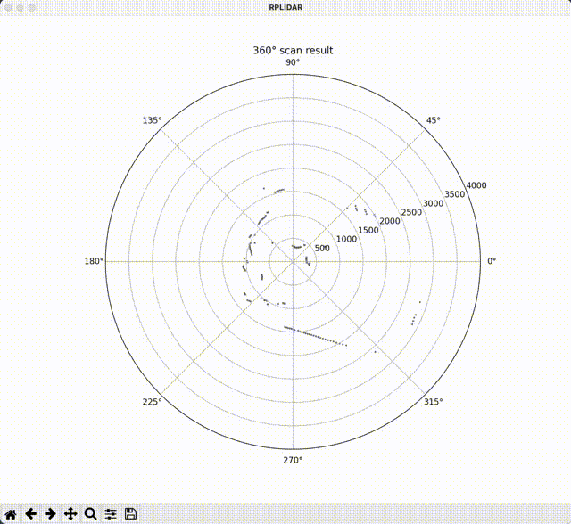

# RPLidar A1M8

**:point_right: Very Important :point_left:**

You can adapt, improve and use the code for your projects as you wish. The author of this repository take no responsibility for your use or misuse or any damage on your devices!

## Information

The Python3 scripts for [RPLIDAR A1](https://www.slamtec.com/en/Lidar/A1) run on Linux, macOS and Windows. 
Latest rplidar documentation can be found [here](https://rplidar.readthedocs.io/en/latest/). 
If you prefer C++, please have a look [here](https://github.com/slamtec/rplidar_sdk).

Examples:

- COM3 (_Windows_)
- /dev/ttyUSB0 (_Linux_)
- /dev/tty.usbserial-0001 (_macOS_)

Additional documents are available:

- [A1M8 Datasheet](https://bucket-download.slamtec.com/d1e428e7efbdcd65a8ea111061794fb8d4ccd3a0/LD108_SLAMTEC_rplidar_datasheet_A1M8_v3.0_en.pdf)
- [A1M8 Dev Kit User Manual](https://bucket-download.slamtec.com/269e60a69933dffb1067a2ee3405f2918168064a/LM108_SLAMTEC_rplidarkit_usermanual_A1M8_v2.1_en.pdf)
- [Protocol](https://bucket-download.slamtec.com/f010c72be308cdc618e91746d643278185ed02b2/LR001_SLAMTEC_rplidar_protocol_v2.2_en.pdf)

## Setup

**Clone Repository**

```shell
# clone repository
$ git clone https://github.com/Lupin3000/RPLidar.git

# change directory
$ cd RPLidar/
```

**Create virtualenv (_for Python 3.x_)**

> The use of virtualenv is not mandatory but recommended.

```shell
# create virtualenv
$ virtualenv -p python3 venv

# activate virtualenv
$ . venv/bin/activate

# install packages
(venv) $ pip3 install -r requirements.txt 
```

## Execute Python scripts

**Display Device Information**

```shell
# show script help
(venv) $ python3 device_info.py -h

# display rplidar information and health status (macOS)
(venv) $ python3 device_info.py '/dev/tty.usbserial-0001'

# display rplidar information and health status (Linux)
(venv) $ python3 device_info.py '/dev/ttyUSB0'
```

**Display Speed Information**

```shell
# show script help
(venv) $ python3 device_speed.py -h

# display rplidar speed information (macOS)
(venv) $ python3 device_speed.py /dev/tty.usbserial-0001

# display rplidar speed information (Linux)
(venv) $ python3 device_speed.py /dev/ttyUSB0
```

**Display Measurements on Terminal**

```shell
# show script help
(venv) $ python3 device_measurement.py -h

# display rplidar measurements (Linux)
(venv) $ python3 device_measurement.py /dev/ttyUSB0

# display rplidar measurements without any other output (macOS)
(venv) $ python3 device_measurement.py /dev/tty.usbserial-0001 --raw

# forward rplidar measurements to file (Linux)
(venv) $ python3 device_measurement.py /dev/ttyUSB0 --raw >> output.txt

# output rplidar measurements to file and in the terminal (macOS)
(venv) $ python3 device_measurement.py /dev/tty.usbserial-0001 --raw | tee output.txt
```

**Plot Measurements**

```shell
# show script help
(venv) $ python3 device_plot.py -h

# output rplidar measurements as plot (macOS)
(venv) $ python3 device_plot.py /dev/tty.usbserial-0001
```

**Calibration**

- Purple output from 350 to 360.n
- Yellow output for exact 0
- Blue output from 0.n to 10

```shell
# show script help
(venv) $ python3 device_calibration.py -h

# output in terminal (macOS)
(venv) $ python3 device_calibration.py /dev/tty.usbserial-0001
```

_Example output:_



**Stop virtualenv**

```shell
# stop virtualenv
(venv) $ deactivate
```

## Error

**General**

[Error] Could not found device: /dev/tty.usbserial-0001...

> Make sure the RPLIDAR is properly connected via USP and visible.
> No (_similar_) output means that something went wrong. Please check all connections!

```shell
# list all /dev/tty devices and grep for USB
$ ls -la /dev/tty* | grep -i USB
crw-rw-rw-  1 root   wheel   0x9000004 Jan 30 17:25 /dev/tty.usbserial-0001
```

**Linux**

Cannot read from /dev/ttyUSB0...

> Root privilege is needed to access the ttyUSB device under Linux.
> Following quick and dirty solution can help or add KERNEL=="ttyUSB*", MODE="0666" to the configuration of udev, and reboot.

```shell
# list device and permissions
$ ls -la /dev | grep ttyUSB

# change permissions
$ sudo chmod 0666 /dev/ttyUSB0
```

**PyCharm**

PyCharm show the problem "Unsatisfied package requirement inspection"...

> Because in file `requirements.txt` is written `rplidar-roboticia` and not `rplidar`. 
> See [PyPi page](https://pypi.org/project/rplidar-roboticia/).
> Since RPLidar hardware is shipping with firmware >= 1.29 the usage of `$ pip3 install rplidar` will no more work! 
> Please ignore such problem information.

**Plot animation don't work**

The matplotlib animation does print only static... 

> I have no idea ... just assumptions. 
> I developed and tested the code (_directly via USB_) on macOS Monterey Version 12.1 and there it works.
> Here is the evidence recorded as video and convert to gif.


